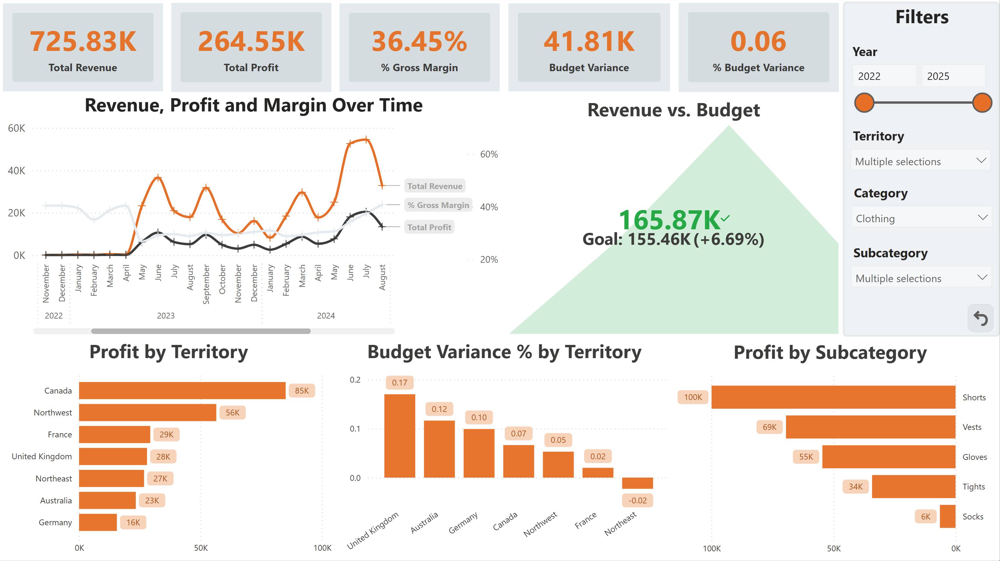
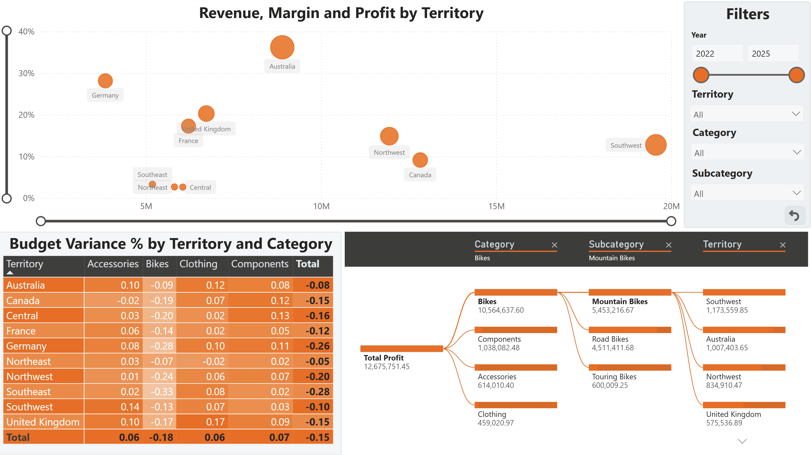
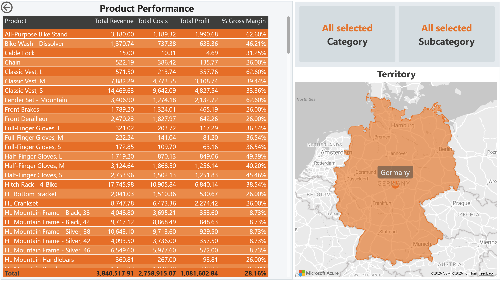

# Margin Drivers & Profitability Analysis

## Project Objective

The goal of this project is to develop a Power BI dashboard for analyzing revenue, profitability, and budget variances.

The main focus is to analyze profitability drivers. Revenue, cost, and profit are examined from different perspectives, particularly by Territory, Category, Subcategory, and Date.

In addition, budget values are integrated into the analysis to highlight differences between planned and actual business performance.

## Dataset

The data source for this project is the AdventureWorks database from Microsoft.

The project uses operational sales data (OLTP), which was transformed into an analytical model for reporting and analysis purposes. Based on this model, revenue, cost, profit, and budget metrics are calculated.

> For more details, see the README of the [AdventureWorks Database](https://github.com/microsoft/sql-server-samples/tree/master/samples/databases/adventure-works) on GitHub.
 
## Data Model

The analytical model is based on a snowflake schema with separate fact and dimension tables for sales, budget, products, territories, and date.

A detailed description of the data modeling process, table selection, cost calculation, budget generation, and the decision to use a snowflake schema instead of a pure star schema can be found in the project documentation.

> For more details, see the [Project Documentation](docs/modeling.md)

### Analytical Model

## Dashboard Pages

The report consists of several pages that focus on different aspects of business performance. The pages are designed for the needs of different business areas:

- Management
- Regional Management
- Product Management

To provide users with access only to relevant data, Row-Level Security (RLS) roles were implemented. 

| Role | Demo                                |
|---|-------------------------------------|
| Management | [Watch video](videos/executive.mp4) |
| Regional Management | [Watch video](LINK)                 |
| Product Management | [Watch video](LINK)                 |

### Executive Overview

The Executive Overview provides a high-level summary of business performance and serves as the starting point of the report.

Business questions answered:

- How do revenue, profit, and margin develop over time?
- Is the planned budget being achieved?
- Which territories contribute most to profit?
- Which territories show the largest budget variances?
- Which subcategories contribute most to profit?

### Executive Overview

This page combines KPI cards, trend analysis, budget tracking, and ranking visualizations to provide a quick overview of business performance and key profitability drivers.

### Profitability Drivers

The Profitability Drivers page focuses on the factors that influence profit performance across territories, categories and subcategories.

Business questions answered:

- Which territories combine high revenue, profit and gross margin?
- How does budget variance differ across territories and categories?
- Which categories and subcategories contribute most to total profit?
- How can total profit be decomposed across category, subcategory and territory?

### Profitability Drivers

This page combines a territory scatter plot, a budget variance matrix and a decomposition tree. It enables users to compare profitability patterns, identify budget variance patterns and explore the main drivers behind total profit.

### Product Details

The Product Details page provides a detailed product-level view and is accessed through drillthrough actions from other report pages.

Business questions answered:

- Which individual products contribute most to revenue and profit?
- How do revenue, costs, profit and gross margin compare at product level?
- Which products belong to the currently selected territory, category or subcategory?
- How does product performance change under different filter selections?

### Product Details

This page contains a detailed product-level table showing revenue, costs, profit and gross margin for each product. Context cards and a territory map provide additional information about the current drillthrough selection, while the page inherits filters from the source page to support focused analysis. 