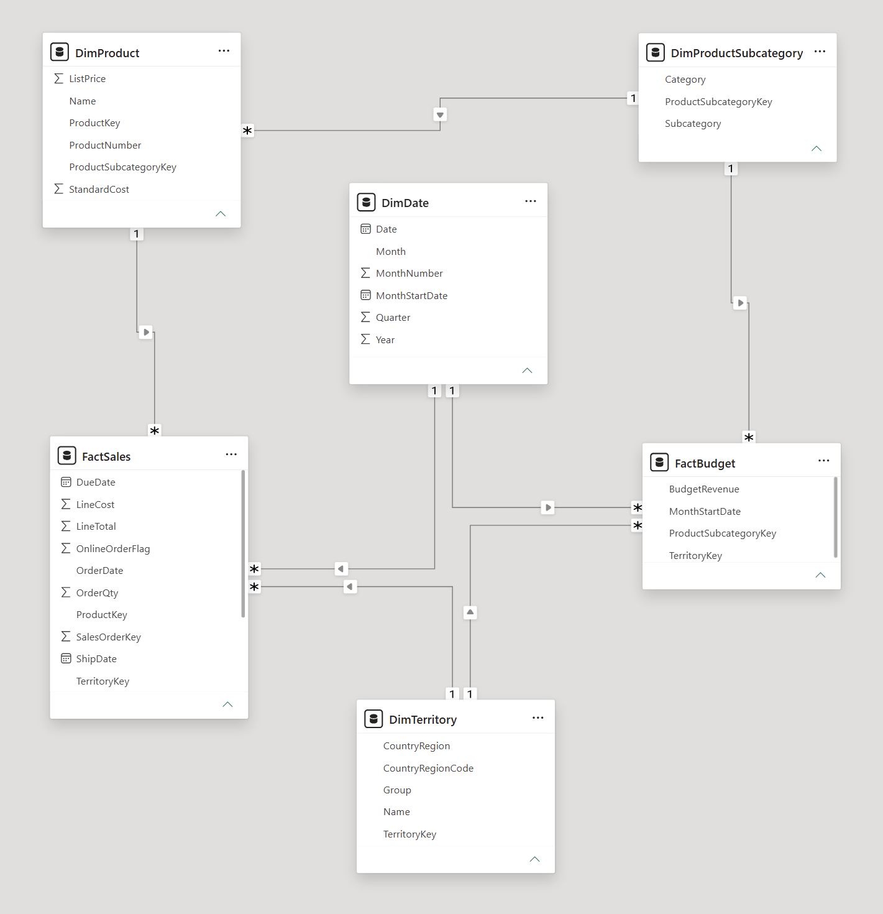

# Datenmodellierung

## Projektziel

Dieses Dokument beschreibt den Aufbau eines analytischen Datenmodells auf Basis der AdventureWorks-OLTP-Datenbank.

Ziel des Projekts ist die Analyse von Umsatz, Kosten, Marge und Budgetabweichungen. Der Fokus liegt auf der Identifikation struktureller Profitabilitätstreiber wie Produktgruppen, Regionen und zeitlichen Entwicklungen.

Die Dokumentation beschreibt die wichtigsten Entscheidungen und Überlegungen während der Modellierung sowie den Weg vom operativen Datenmodell zum analytischen Modell für Power BI.

---

## Ausgangssituation und Vorgehensweise

AdventureWorks stellt eine große Anzahl miteinander verknüpfter Tabellen bereit. Da nicht alle Tabellen für die Analyse relevant sind, wurde das Modell schrittweise ausgehend von den Verkaufsdaten aufgebaut.

Ausgangspunkt waren die Tabellen:

- SalesOrderDetail
- SalesOrderHeader

Da diese Tabellen die eigentlichen Verkaufsdaten enthalten, war von Beginn an klar, dass sie für die Analyse benötigt werden.

Die Modellierung erfolgte nach folgendem Prinzip:

1. Offensichtlich irrelevante Spalten entfernen
2. Unsichere Spalten zunächst behalten
3. Fremdschlüssel zu weiteren Tabellen verfolgen
4. Analytische Relevanz der gefundenen Tabellen bewerten
5. Nur Tabellen übernehmen, die zur Beantwortung der Projektfragestellung beitragen

Dadurch entstand das Modell schrittweise ausgehend vom eigentlichen Verkaufsprozess.

---

## Aufbau der FactSales-Tabelle

Die Faktentabelle basiert auf einer Zusammenführung von SalesOrderDetail und SalesOrderHeader.

SalesOrderDetail enthält die einzelnen Verkaufspositionen. SalesOrderHeader ergänzt Informationen wie Verkaufsgebiet und Datumsangaben.

Für die Analyse wurden ausschließlich Attribute übernommen, die zur Untersuchung von Umsatz, Kosten und Profitabilität beitragen.

### Umsatz

Als Umsatzgröße wurde LineTotal verwendet.

### Kosten

Für die Kostenberechnung wurde StandardCost aus der Produkttabelle verwendet.

### Ausgeschlossene Kennzahlen

Folgende Werte wurden bewusst nicht in die Analyse übernommen:

- TaxAmt
- Freight
- TotalDue

Diese Werte liegen auf Auftragsebene vor und stellen keine zentralen Profitabilitätstreiber des Projekts dar. Eine Verteilung auf einzelne Verkaufspositionen hätte zusätzliche Komplexität erzeugt, ohne einen wesentlichen analytischen Mehrwert zu liefern.

---

## Auswahl und Ausschluss von Tabellen

Die Auswahl der Dimensionen erfolgte schrittweise über die in den Verkaufstabellen vorhandenen Fremdschlüssel.

Untersucht wurden zahlreiche Tabellen aus dem AdventureWorks-Modell. Nicht jede Tabelle wurde übernommen.

| Tabelle | Begründung |
|----------|----------|
| SalesPerson | Fokus würde auf Mitarbeiterperformance wechseln |
| Customer | Fokus würde auf Kundenanalyse wechseln |
| SalesReason | Fokus würde auf Marketinganalyse wechseln |
| SpecialOffer | Fokus würde auf Promotionsanalyse wechseln |
| Purchase-Daten | Fokus würde auf Beschaffung und Einkauf wechseln |

Diese Tabellen wurden bewusst ausgeschlossen, um den Fokus auf strukturelle Profitabilitätstreiber beizubehalten.

---

## Analyse der Produktdimension

Die Produktdimension erforderte eine genauere Untersuchung.

Zunächst fiel auf, dass ProductSubcategoryID bei vielen Produkten nicht belegt war. Eine genauere Analyse ergab jedoch, dass die Produkttabelle sowohl verkaufte als auch nie verkaufte Produkte enthält.

Nach einer Beschränkung auf die tatsächlich verkauften Produkte zeigte sich:
- ProductSubcategoryID ist vollständig belegt.
- StandardCost ist vollständig belegt.
- Die zuvor beobachteten Datenqualitätsprobleme betreffen ausschließlich Produkte ohne Verkäufe.

Daraus entstand eine wichtige Modellierungsentscheidung:

Attribute wurden anhand der tatsächlich verkauften Produkte bewertet und nicht anhand der vollständigen OLTP-Tabelle.

Die Produktdimension wurde daher auf Produkte beschränkt, die in den Verkaufsdaten tatsächlich vorkommen.

---

## Aufbau der Territoriumsdimension

Die Territoriumsdimension wurde aus den Tabellen SalesTerritory und CountryRegion aufgebaut.

Dadurch stehen sowohl Verkaufsgebiete als auch die zugehörigen Länderinformationen für die Analyse zur Verfügung.

Die Tabelle StateProvince wurde untersucht, letztlich jedoch nicht übernommen, da sie keinen zusätzlichen analytischen Mehrwert für die Projektziele bietet.

---

## Budgetmodellierung

Neben den Ist-Daten wurde eine zusätzliche Faktentabelle für Budgetwerte aufgebaut.

Ziel ist die spätere Analyse von Budgetabweichungen.

Die Budgetwerte wurden nicht manuell erfasst, sondern aus den tatsächlichen Verkaufsdaten abgeleitet. Dadurch bleiben Budget und Ist-Daten in einem realistischen Verhältnis.

---

## Entscheidung zur Budgetgranularität

Für die Budgetdaten wurden verschiedene Granularitäten betrachtet.

Eine Budgetierung auf Produktebene wurde bewusst verworfen.

In der Praxis werden Budgets häufig für Produktgruppen und nicht für einzelne Produkte geplant. Eine Verteilung auf einzelne Produkte hätte die Granularität künstlich erhöht, ohne zusätzlichen analytischen Nutzen zu schaffen.

Die Budget-Faktentabelle wurde daher auf folgender Ebene modelliert:

- Monat
- Territory
- Product Subcategory

Die Budget-Faktentabelle enthält insgesamt 5.465 eindeutige Kombinationen aus:

- Monat
- Territory
- Product Subcategory

Dadurch entsteht eine fachlich sinnvolle Planungsebene bei gleichzeitig überschaubarer Datenmenge.

Da die Verkaufsdaten auf Produktebene und die Budgetdaten auf Subkategorie-Ebene vorliegen, wurde eine zusätzliche ProductSubcategory-Dimension eingeführt.

Dadurch weist das Modell kein reines Sternschema auf. Diese Entscheidung wurde bewusst getroffen, da die fachlich sinnvolle Granularität der Budgetplanung höher gewichtet wurde als die vollständige Vermeidung eines Snowflakes.

---

## Aufbau der FactBudget-Tabelle

Die Budget-Faktentabelle wurde aus den Verkaufsdaten abgeleitet.

Zunächst wurden die Umsätze auf folgende Ebene aggregiert:

- Monat
- Territory
- Product Subcategory

Anschließend wurden Budgetfaktoren angewendet, aus denen die Budgetwerte berechnet wurden.

Die Budgetwerte basieren somit auf realen Verkaufsdaten und nicht auf frei gewählten Zahlen.

---

## Budgetdesign

Zur Steuerung der Budgetwerte wurde eine Hilfstabelle mit Budgetfaktoren erstellt.

Für die meisten Kombinationen wurden Budgetfaktoren zwischen 0.85 und 1.15 verwendet. 

Zusätzlich wurden einige ausgewählte Territory-Subcategory-Kombinationen bewusst mit stärkeren Abweichungen versehen, um realistische Budgetüber- und Budgetunterschreitungen zu erzeugen. 

Die Ausreißer wurden bewusst auf Kombinationen mit relevantem Umsatzvolumen gelegt, damit die Abweichungen später in den Visualisierungen sichtbar und analytisch aussagekräftig sind.

### Beispielhafte Budget-Ausreißer

| Territory | Subcategory | BudgetFactor |
|------------|------------|------------:|
| Germany | Road Bikes | 1.40 |
| France | Mountain Bikes | 1.35 |
| United Kingdom | Touring Bikes | 1.30 |
| Australia | Helmets | 0.70 |
| Southwest | Tires and Tubes | 0.75 |

---

## Finale Modellstruktur

Das finale Modell besteht aus:

### Faktentabellen

- FactSales
- FactBudget

### Dimensionen

- DimDate
- DimProduct
- DimProductSubcategory
- DimTerritory

### Hilfstabellen

- BudgetFactor

Screenshot des finalen Datenmodells:

Das Modell bildet die Grundlage für die spätere Analyse von Umsatz, Kosten, Marge und Budgetabweichungen in Power BI.
